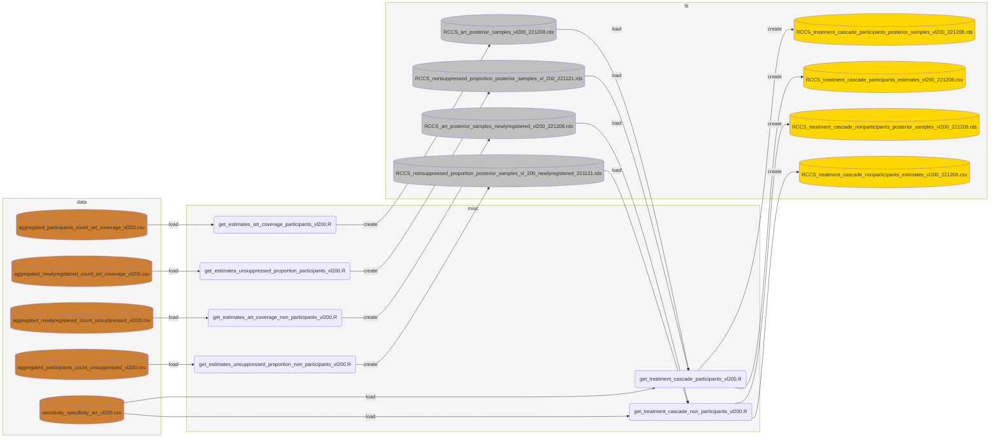
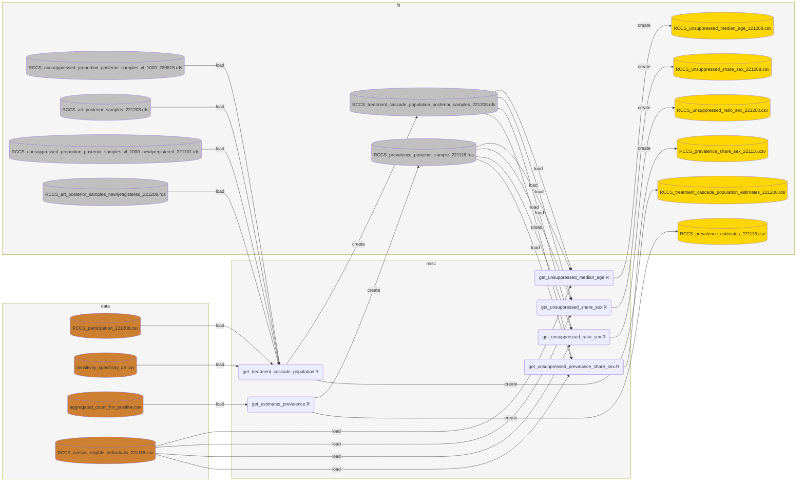

# phyloSI-RakaiAgeGender
[](https://creativecommons.org/licenses/by/4.0/)

**Welcome!** This repository contains the code and data for the analyses presented in the paper *Growing gender inequity in HIV infection in Africa: sources and policy implications* by M Monod, A Brizzi, R Galiwango, R Ssekubugu, Y Chen, X Xi et al.

- [License](#license)
- [Warrenty](#warranty)
- [Citation](#cite)
- [Acknowledgements](#acknowledgements)
- [Funding](#funding)
- [Quick Start](#quick-start)
  - [System Requirements](#system-requirements)
  - [Installation](#installation)
  - [Usage](#usage)
- [Data Documentation](#data-documentation)
  - [Sample Data](#sample-data)
  - [Generated Data](#generated-data)

## License
The code and data in this repository are licensed under [CC-BY-4.0](https://creativecommons.org/licenses/by/4.0/) by Imperial College London. Copyright Imperial College London 2022. 

## Warranty

Imperial makes no representation or warranty about the accuracy or completeness of the data nor that the results will not constitute in infringement of third-party rights. Imperial accepts no liability or responsibility for any use which may be made of any results, for the results, nor for any reliance which may be placed on any such work or results.

## Citation

## Acknowledgements

<!--
We thank all contributors, program staff and participants to the Rakai Community Cohort Study; all members of the PANGEA-HIV consortium, the Rakai Health Sciences Program, and CDC Uganda for comments on an earlier version of the manuscript; the Imperial College Research Computing Service (https://doi.org/10.14469/hpc/2232) and the Biomedical Research Computing Cluster at the University of Oxford for providing the computational resources to perform this study; the Office of Cyberinfrastructure and Computational Biology at the National Institute for Allergy and Infectious Diseases for data management support. This study was supported by the Bill & Melinda Gates Foundation (OPP1175094, OPP1084362); the National Institute of Allergy and Infectious Diseases (U01AI051171, U01AI075115, UM1AI069530-16, R01AI087409, U01AI100031, R01AI110324, R01AI114438, K25AI114461, R01AI123002, K01AI125086, R01AI128779, R01AI143333, R21AI145682, R01AI155080); the National Institute of Mental Health (F31MH095649, R01MH099733, R01MH107275, R01MH115799); the National Institute of Child Health and Development (R01HD038883, R01HD050180, R01HD070769, R01HD091003); the Division of Intramural Research of the National Institute for Allergy and Infectious Diseases (K01AA024068), the National Heart, Lung, and Blood Institute (R01HL152813), the Fogarty International Center (D43TW009578, D43TW010557), the World Bank, the Doris Duke Charitable Foundation, the Johns Hopkins University Center for AIDS Research (P30AI094189), and the President’s Emergency Plan for AIDS Relief through the Centers for Disease Control and Prevention (NU2GGH000817). 
-->

We thank all contributors, program staff and participants to the Rakai Community Cohort Study; all members of the PANGEA-HIV consortium, the [Rakai Health Sciences Program](https://www.rhsp.org/index.php), and CDC Uganda for comments on an earlier version of the manuscript.

We also extend our gratitude to the [Imperial College Research Computing Service](https://doi.org/10.14469/hpc/2232) and the [Biomedical Research Computing Cluster](https://www.bdi.ox.ac.uk/about/biomedical-research-computing) at the University of Oxford for providing the computational resources to perform this study. Additionally, we thank the Office of Cyberinfrastructure and Computational Biology at the [National Institute for Allergy and Infectious Diseases](https://www.niaid.nih.gov/) for data management support.

## Funding

This study was supported by the following organizations:
- [Bill & Melinda Gates Foundation](https://www.gatesfoundation.org/) (OPP1175094, OPP1084362)
- [National Institute of Allergy and Infectious Diseases](https://www.niaid.nih.gov/) (U01AI051171, U01AI075115, UM1AI069530-16, R01AI087409, U01AI100031, R01AI110324, R01AI114438, K25AI114461, R01AI123002, K01AI125086, R01AI128779, R01AI143333, R21AI145682, R01AI155080)
- [National Institute of Mental Health](https://www.nimh.nih.gov/) (F31MH095649, R01MH099733, R01MH107275, R01MH115799)
- [National Institute of Child Health and Development](https://www.nichd.nih.gov/) (R01HD038883, R01HD050180, R01HD070769, R01HD091003)
- Division of Intramural Research of the [National Institute for Allergy and Infectious Diseases](https://www.niaid.nih.gov/) (K01AA024068)
- [National Heart, Lung, and Blood Institute](https://www.nhlbi.nih.gov/) (R01HL152813)
- [Fogarty International Center](https://www.fic.nih.gov/) (D43TW009578, D43TW010557)
- World Bank
- [Doris Duke Charitable Foundation](https://www.ddcf.org/)
- [Johns Hopkins University Center for AIDS Research](https://hopkinscfar.org/) (P30AI094189)
- [President’s Emergency Plan for AIDS Relief](https://www.state.gov/pepfar/) through the Centers for Disease Control and Prevention (NU2GGH000817)


## Quick Start
### System Requirements
- macOS or UNIX, the code was developed on macOS Big Sur 11.7
- [R](https://www.r-project.org/) version >= 4.1.2


### Installation 
A ```yml``` file is provided and can be used to build a conda virtual environment containing all R dependencies. Create the environment using:
```bash
$ cd phyloSI-RakaiAgeGender
$ conda env create -f phyloSI-RakaiAgeGender.yml
```
Then activate the environment for use:
```bash
$ source activate phyloSI-RakaiAgeGender
```
The code reposistory contains the following directories and functions:
| Directory | Content |
| --- | --- |
| `src/` | TODO |


### Usage

#### Pre-process data

We provide all pathogen genomic and epidemiologic input data to reproduce our analyses in non-identifiable aggregate form, or have anonymised individual-level sample identifiers and have randomized individual-level data entries throughout.

Our main analysis functions on estimating incidence dynamics and transmission flows depend on estimates of population sizes, prevalence, virus suppression. Please run the following once:
```shell
$ bash preprocess.sh
```

The flow chart below illustrates how the data is processed based the [medallion architecture](https://www.databricks.com/glossary/medallion-architecture).
#### Stage 1


#### Stage 2


#### Stage 3


#### Age-specific HIV incidence rates
To run the age-specific HIV incidence rates analysis, open up command line tools. Then cd into the repository, and specify the absolute path to the git repository as well as the output directory in which to save the results. 

Then run: 
```bash
$ INDIR="absolute/path/to/phyloSI-RakaiAgeGender"
$ OUTDIR="absolute/path/to/output/directory"
$ Rscript scripts/run_incidence_rates_estimation.R --indir=$INDIR --outdir=$OUTDIR
```

#### Transmission flows analysis
For the transmission flows analysis, we provide a bash shell script that can be run on a laptop. 

Set the **absolute path** to the output directory where the results should be stored in **line 7** of `run_stan_laptop.sh`: 
```bash
OUTDIR="absolute/path/to/output/directory"
```

Open up command line tools, cd into the repository, and run:
```bash
$ source activate phyloSI-RakaiAgeGender
$ bash run_stan_laptop.sh
```

This script will create two shell scripts, `bash_gp_220108-cutoff_2014.sh` and `bash_gp_220108-cutoff_2014-postprocessing.sh`, in the directory specified by `OUTDIR`. The first script, `bash_gp_220108-cutoff_2014.sh`, fits the age- and gender-specific phyloSI model to the Rakai data with Stan. The second script, `bash_gp_220108-cutoff_2014-postprocessing.sh`, performs diagnostic checks on the fitted model, creates posterior summaries, and generates figures. You will need to execute both scripts one after the other:
```bash
$ source activate phyloSI-RakaiAgeGender
$ cd $OUTDIR
$ bash bash_gp_220108-cutoff_2014.sh
$ bash bash_gp_220108-cutoff_2014-postprocessing.sh
```


## Data and script reference

### Sample Data
The table below lists the data files within `/data` and a brief description of its contents
| File name | Description |
|---|---|
| ```pairsdata_toshare_d1_w11_netfrompairs_postponessrm.rds``` | HIV source-recipient pairs |
| ```RCCS_census_eligible_individuals_221116.csv``` | Count of census eligible population by age, gender and round |
| ```RCCS_participation_221208.csv``` | Participation rates to the RCCS survey by age, gender and round |
| ```aggregated_count_hiv_positive.csv``` | Count of participants by hiv status, age, gender and round used in ```misc/get_estimates_prevalence.R``` to estimate smooth proportion of hiv prevalence among population. |
| ```aggregated_participants_count_art_coverage.csv``` | count of participants by self-reported art use, age, gender and round, used in ```misc/get_estimates_art_coverage_participants.R``` to estimate smooth proportion of art coverage among participants. |
| ```aggregated_participants_count_unsuppressed.csv``` |count of participants by viremic viral loads, age, gender and round, used in ```misc/get_estimates_unsuppressed_proportion_participants.R``` to estimate smooth proportion of viral suppression among participants. |
| ```aggregated_newlyregistered_count_art_coverage.csv``` | count of first-time participants by self-reported art use, age, gender and round, used in ```misc/get_estimates_art_coverage_non_participants.R``` to estimate smooth proportion of art coverage among first-time participants. |
|```aggregated_newlyregistered_count_unsuppressed.csv```|count of first-time participants by viremic viral loads, age, gender and round, used in ```misc/get_estimates_unsuppressed_proportion_non_participants.R``` to estimate smooth proportion of viral suppression among first-time participants.|
| ```seroconverter_cohort_R6R19.rds``` | Individual-level seroconvert cohort data with information on rounds of enrollment, age, sex, hiv status | 
| ```Rakai_incpredictions_inland_221107.csv``` |HIV incidence rates estimates by age, gender and round | 
| ```inland_R015_cntcts_rate_1130b.rds``` | Sexual contact rate estimates by age and gender for round 15 |

## Generated Data
| File name | Description |
| --- | --- |
| ```RCCS_prevalence_estimates_DATE.csv``` | Smooth proportion of hiv prevalence in population by age, gender and round |
| ```RCCS_treatment_cascade_population_estimates_DATE.csv``` | Smooth estimates of art coverage and viral suppression in population by age, gender and round |
| ```RCCS_treatment_cascade_participants_estimates_DATE.csv``` | Smooth estimates of art coverage and viral suppression in participants by age, gender and round |
| ```RCCS_treatment_cascade_nonparticipants_estimates_DATE.csv``` | Smooth estimates of art coverage and viral suppression in first-time participants by age, gender and round in file  |

## Scripts

The following table list the actions performed by each of the available scripts:
| Action | Script |
| --- | --- |
| Obtain smooth HIV prevalence by age, gender, and round | `misc/get_estimates_prevalence.R` |
| Obtain smooth ART coverage in participants by age, gender, and round | `misc/get_estimates_art_coverage_participants.R` |
| Obtain smooth ART coverage in first-time participants by age, gender, and round | `misc/get_estimates_art_coverage_non_participants.R` |
| Obtain smooth viral suppression in participants by age, gender, and round | `misc/get_estimates_unsuppressed_proportion_participants.R` |
| Obtain smooth viral suppression in first-time participants by age, gender, and round | `misc/get_estimates_unsuppressed_proportion_non_participants.R` |
| Combine ART coverage and viral suppression estimates to obtain treatment cascade in participants | `misc/get_treatment_cascade_participants.R` |
| Combine ART coverage and viral suppression estimates to obtain treatment cascade in first-time participants | `misc/get_treatment_cascade_non_participants.R` |
| Combine ART coverage and viral suppression estimates to obtain treatment cascade in population | `misc/get_treatment_cascade_population.R` |

 
