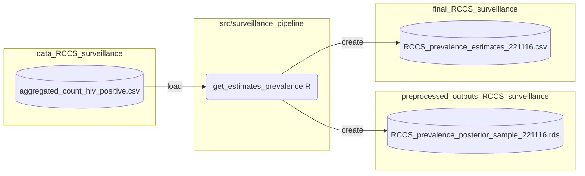
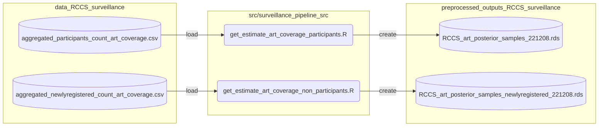
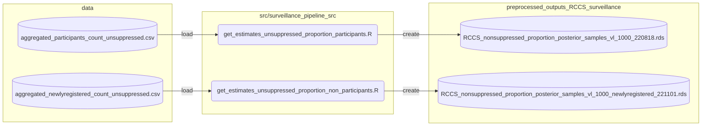
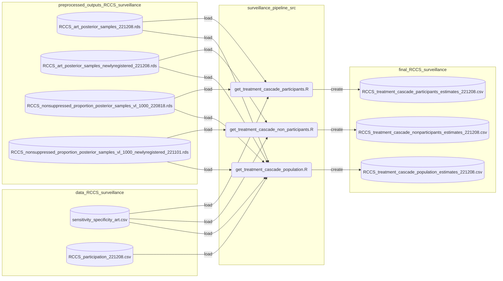

## Table of Contentes
- [Data Repository Structure](#data-repository-structure)
- [Code Repository Structure](#code-repository-structure)
- [RCCS Surveillance Analyses](#rccs-surveillance-analyses)
  - [Estimate HIV status and prevalence](#estimate-hiv-status-and-prevalence)
  - [Estimate ART use](#estimate-art-use)
  - [Estimate viral suppresion](#estimate-viral-suppresion)
  - [Estimate treatment cascade](#estimate-treatment-cascade)

### Data Repository Structure
We provide all the data required to produce the findings in our paper via Zenodo (TODO: Add link). The directory is structured as follows:
<pre>
.
├── data_RCCS_surveillence
├── data_incidence_rate
├── data_deep_sequence_phylogenies
├── preprocessed_outputs_RCCS_surveillence
├── preprocessed_outputs_deep_sequence_phylogenies
├── final_RCCS_surveillence
├── final_incidence_rate
├── final_sexual_partnership
├── final_transmission_flow
└── final_central_analysis
</pre>
`data_*` directories contain de-identified data which serves as the starting point of all analysis. `preprocessed_*` directories contain intermediate data files produced by the scripts within the `src` directory. `final_*` contains cleaned data or model outputs which are directly used to produce figures and tables. A list of discriptions for the data can be found at `docs/README.md`.

### GitHub Repository Structure
The contents of the repository and short discriptions are as follows:
<pre>
.
├── R                                                # R helper functions 
├── docs                                             # Documentation
├── figure_src                                       # Scripts to generate paper figures 
├── scripts                                          # R scripts for final analysis
├── src                                              # R scripts for sub-analysis 
├── stan_models                                      # Stan code
├── ...
├── config.R                                         # Path configurations
├── phyloSI-RakaiAgeGender-install.sh                # Installation
├── phyloSI-RakaiAgeGender-install-macosM1.sh        # Installation for Apple M1
├── phyloSI-RakaiAgeGender-preprocessing.sh          # Preprocess data and run sub-analyses
├── phyloSI-RakaiAgeGender-run_phyloflows-hpc.sh     # Run final analysis on Imperial HPC
├── phyloSI-RakaiAgeGender-run_phyloflows-laptop.sh  # Run final analysis on laptop
└── ...
</pre>

### RCCS Surveillance Analysis
The flowcharts below illustrates in detail how the data is consumed and processed by various R scripts at each stage. The silos, rounded boxes, and yellow boxes, represent data, R scripts, and directories respectively.

#### Estimate HIV status and prevalence

#### Estimate ART use

#### Estimate viral suppresion

#### Estimate treatment cascade

## Data and script reference

### Sample Data
The table below lists the data files within `/data` and a brief description of its contents

<b>Click to show table</b>

  <table>
    <thead>
      <tr>
        <th>File name</th>
        <th>Description</th>
      </tr>
    </thead>
  <tbody>
    <tr>
      <td><code>pairsdata_toshare_d1_w11_netfrompairs_postponessrm.rds</code></td>
      <td>HIV source-recipient pairs</td>
    </tr>
    <tr>
      <td><code>RCCS_census_eligible_individuals_221116.csv</code></td>
      <td>Count of census eligible population by age, gender and round</td>
    </tr>
      <tr>
      <td><code>RCCS_participation_221208.csv</code></td>
      <td>Participation rates to the RCCS survey by age, gender and round</td>
      </tr>
    <tr>
      <td><code>aggregated_count_hiv_positive.csv</code></td>
      <td>Count of participants by hiv status, age, gender and round used in <code>surveillance_pipeline_src/get_estimates_prevalence.R</code> to estimate smooth proportion of hiv prevalence among population.</td>
    </tr>
    <tr>
      <td><code>aggregated_participants_count_art_coverage.csv</code></td>
      <td>count of participants by self-reported art use, age, gender and round, used in <code>surveillance_pipeline_src/get_estimates_art_coverage_participants.R</code> to estimate smooth proportion of art coverage among participants.</td>
    </tr>
    <tr>
      <td><code>aggregated_participants_count_unsuppressed.csv</code></td>
      <td>count of participants by viremic viral loads, age, gender and round, used in <code>surveillance_pipeline_src/get_estimates_unsuppressed_proportion_participants.R</code> to estimate smooth proportion of viral suppression among participants.</td>
    </tr>
    <tr>
      <td><code>aggregated_newlyregistered_count_art_coverage.csv</code></td>
      <td>count of first-time participants by self-reported art use, age, gender and round, used in <code>surveillance_pipeline_src/get_estimates_art_coverage_non_participants.R</code> to estimate smooth proportion of art coverage among first-time participants.</td>
    </tr>
    <tr>
      <td><code>aggregated_newlyregistered_count_unsuppressed.csv</code></td>
      <td>count of first-time participants by viremic viral loads, age, gender and round, used in <code>surveillance_pipeline_src/get_estimates_unsuppressed_proportion_non_participants.R</code> to estimate smooth proportion of viral suppression among first-time participants.</td>
    </tr>
    <tr>
      <td><code>seroconverter_cohort_R6R19.rds</code></td>
      <td>Individual-level seroconvert cohort data with information on rounds of enrollment, age, sex, hiv status</td>
      </tr>
      <tr>
      <td><code>Rakai_incpredictions_inland_221107.csv</code></td>
      <td>HIV incidence rates estimates by age, gender and round</td>
    </tr>
    <tr>
      <td><code>inland_R015_cntcts_rate_1130b.rds</code></td>
      <td>Sexual contact rate estimates by age and gender for round 15</td>
    </tr>
       <tr>
      <td><code>Rakai_Pangea2_RCCS_Metadata_randomized.RData  data/sequences_collection_dates_randomized.rds</code></td>
      <td>Individual-level meta data containing Anonymised IDs, round sex, community type, and randomized visit dates,  birthdays, and test dates  </td>
    </tr>
         <tr>
      <td><code>sequences_collection_dates_randomized.rds</code></td>
      <td> Blood samples collection dates randomized within 6 months. </td>
    </tr>
    </tbody>
  </table>

### Generated Data

<b>Click to show table</b>

<table>
  <thead>
    <tr>
      <th>File name</th>
      <th>Description</th>
    </tr>
  </thead>
  <tbody>
    <tr>
      <td><code>RCCS_prevalence_estimates_DATE.csv</code></td>
      <td>Smooth proportion of HIV prevalence in population by age, gender and round</td>
    </tr>
    <tr>
      <td><code>RCCS_treatment_cascade_population_estimates_DATE.csv</code></td>
      <td>Smooth estimates of ART coverage and viral suppression in population by age, gender and round</td>
    </tr>
    <tr>
      <td><code>RCCS_treatment_cascade_participants_estimates_DATE.csv</code></td>
      <td>Smooth estimates of ART coverage and viral suppression in participants by age, gender and round</td>
    </tr>
    <tr>
      <td><code>RCCS_treatment_cascade_nonparticipants_estimates_DATE.csv</code></td>
      <td>Smooth estimates of ART coverage and viral suppression in first-time participants by age, gender and round</td>
    </tr>
  </tbody>
</table>

### Scripts

The following table list the actions performed by each of the scripts in `surveillance_pipeline_src/`:

  
<b>Click to show table</b>

  <table>
    <thead>
      <tr>
        <th>Action</th>
        <th>Script</th>
      </tr>
    </thead>
    <tbody>
      <tr>
        <td>Obtain smooth HIV prevalence by age, gender, and round</td>
        <td><code>get_estimates_prevalence.R</code></td>
      </tr>
      <tr>
        <td>Obtain smooth ART coverage in participants by age, gender, and round</td>
        <td><code>get_estimates_art_coverage_participants.R</code></td>
      </tr>
      <tr>
        <td>Obtain smooth ART coverage in first-time participants by age, gender, and round</td>
        <td><code>get_estimates_art_coverage_non_participants.R</code></td>
      </tr>
      <tr>
        <td>Obtain smooth viral suppression in participants by age, gender, and round</td>
        <td><code>get_estimates_unsuppressed_proportion_participants.R</code></td>
      </tr>
      <tr>
        <td>Obtain smooth viral suppression in first-time participants by age, gender, and round</td>
        <td><code>get_estimates_unsuppressed_proportion_non_participants.R</code></td>
      </tr>
      <tr>
        <td>Combine ART coverage and viral suppression estimates to obtain treatment cascade in participants</td>
        <td><code>get_treatment_cascade_participants.R</code></td>
      </tr>
      <tr>
        <td>Combine ART coverage and viral suppression estimates to obtain treatment cascade in first-time participants</td>
        <td><code>get_treatment_cascade_non_participants.R</code></td>
      </tr>
      <tr>
        <td>Combine ART coverage and viral suppression estimates to obtain treatment cascade in population</td>
        <td><code>get_treatment_cascade_population.R</code></td>
      </tr>
    </tbody>
  </table>

